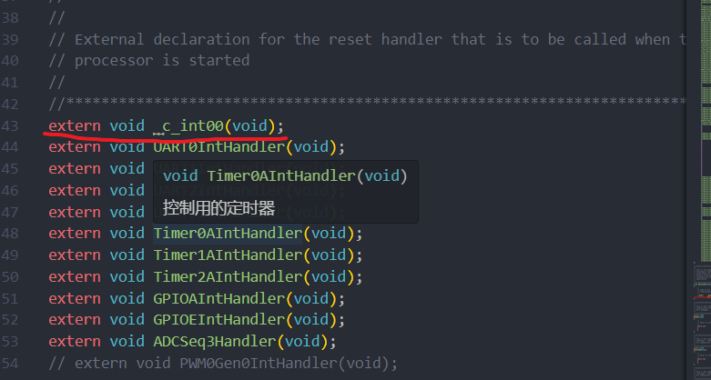
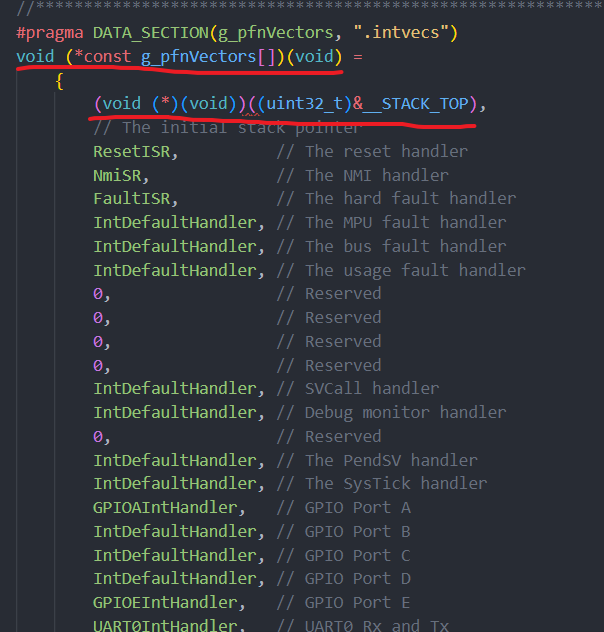

# RGB灯光

RGB灯光亮灭可以说是相当于编程语言”hello，world“一样基础的存在了

根据资料，RGB灯光由PF1、PF2、PF3控制


当赋予这些引脚高电平，对应的颜色就会亮起；根据不同的占空比，可以实现LED灯亮起各种颜色。（分号后面是我猜的，反正实际用不到）

一般在实际应用中，Tiva板配的LED灯就是为了做灯光指示，所以也不需要涉及到占空比这么复杂的配置，只需要三个引脚电平高低的排列组合，给出的颜色已经足够使用了。

## 代码

### 初始化

```c
void initLights()
{
    SysCtlPeripheralEnable(SYSCTL_PERIPH_GPIOF);	//使能GPIOF系列引脚外设功能
    GPIOPinTypeGPIOOutput(GPIO_PORTF_BASE, GPIO_PIN_3); //设置PFx的引脚功能为对外输出
    GPIOPinTypeGPIOOutput(GPIO_PORTF_BASE, GPIO_PIN_2);
    GPIOPinTypeGPIOOutput(GPIO_PORTF_BASE, GPIO_PIN_1);
}
```

### 颜色枚举

进行颜色枚举的定义纯粹是个人喜好，觉得没必要的可以略过

#### Lights.h

```c
enum Color
{
    Red,
    Green,
    Blue,
};
extern enum Color lightColor; 
```

#### Lights.c

```c
enum Color lightColor;
```

在头文件中对枚举类型 `Color`进行定义，在源文件中声明一个 `Color`类型的变量 `lightColor`，然后再在头文件使用 `extern`，使 `lignhtColor`可以被其他文件使用

### 点亮LED灯

```c
void turnOnLights(enum Color color)
{
    switch (color)
    {
    case Red:
        GPIOPinWrite(GPIO_PORTF_BASE, GPIO_PIN_1, GPIO_PIN_1);
        break;
    case Blue:
        GPIOPinWrite(GPIO_PORTF_BASE, GPIO_PIN_2, GPIO_PIN_2);
        break;
    case Green:
        GPIOPinWrite(GPIO_PORTF_BASE, GPIO_PIN_3, GPIO_PIN_3);
        break;
    default:
        break;
    }
}
```

这里是结合了前面定义的Color枚举，实际上只需要将对应颜色的GPIO引脚置为高电平即可

`GPIOPinWrite(GPIO_PORTF_BASE, GPIO_PIN_x, GPIO_PIN_x);`

**比较值得注意的是，在tiva中，在写法上，将引脚置高和stm32有所不同。注意不要写成 `GPIOPinWrite(GPIO_PORTF_BASE, GPIO_PIN_1, 1);`**

### 熄灭LED灯

```c
void turnOffLights(enum Color color)
{
    switch (color)
    {
    case Red:
        GPIOPinWrite(GPIO_PORTF_BASE, GPIO_PIN_1, 0);
        break;
    case Blue:
        GPIOPinWrite(GPIO_PORTF_BASE, GPIO_PIN_2, 0);
        break;
    case Green:
        GPIOPinWrite(GPIO_PORTF_BASE, GPIO_PIN_3, 0);
        break;
    default:
        break;
    }
}
```

和点亮LED灯类似

# 按键

按键是根据同学的stm32的代码改过来了，因为使用了定时器消抖，所以稍微有点复杂

根据前面的资料可以知道，控制两个按键的GPIO引脚分别为PF0和PF4

值得一提的是PF0与PD7两个引脚默认是锁住的，需要人为将其解锁，提供的示例代码是已解锁的，[详细的解锁参考，请跳转至该网页](https://blog.csdn.net/D_XingGuang/article/details/89353795)

## 代码

### 初始化

```
void initKeys()
{
    SysCtlPeripheralEnable(SYSCTL_PERIPH_GPIOF);
    // 解锁PF0
    HWREG(GPIO_PORTF_BASE + GPIO_O_LOCK) = GPIO_LOCK_KEY;
    HWREG(GPIO_PORTF_BASE + GPIO_O_CR) = 0xFF;
    GPIOPinTypeGPIOInput(GPIO_PORTF_BASE, GPIO_PIN_0 | GPIO_PIN_4);
    GPIOPadConfigSet(GPIO_PORTF_BASE, GPIO_PIN_0 | GPIO_PIN_4,
                     GPIO_STRENGTH_2MA, GPIO_PIN_TYPE_STD_WPU);
    // 定时器timer1中断
    SysCtlPeripheralEnable(SYSCTL_PERIPH_TIMER1);
    TimerConfigure(TIMER1_BASE, TIMER_CFG_PERIODIC);
    // 5ms
    TimerLoadSet(TIMER1_BASE, TIMER_A, SysCtlClockGet() / 200);
    TimerIntEnable(TIMER1_BASE, TIMER_TIMA_TIMEOUT);
    IntEnable(INT_TIMER1A);
    TimerEnable(TIMER1_BASE, TIMER_A);
}
```

### 定时器中断

在初始化中，对timer1进行了初始配置，其触发频率为200hz，也就是5ms一次

预装载值是 `SysCtlClockGet() / 200`，默认是向下计数模式

`TimerLoadSet(TIMER1_BASE, TIMER_A, SysCtlClockGet() / 200);`这个写法可以省略计算频率的步骤

另外Tiva的定时器是可以用函数拆分成A，B两个的。32位拆成两个16位定时器，64位拆成两个32位定时器。**需要注意定时器的位数，这决定了定时器能计数的上限，所以一些PWM占空比任务是不能靠修改装载值解决的**

```
void Timer1AIntHandler(void)
{
    TimerIntClear(TIMER1_BASE, TIMER_TIMA_TIMEOUT);

    int temp1 = key1Pressed(50);
    int temp2 = key2Pressed(50);
    if (temp1 == 1)
    {
        Key1SinglePressedFlag = true;
    }
    else if (temp1 == 2)
    {
        Key1DoublePressedFlag = true;
    }
    if (temp2 == 1)
    {
        Key2SinglePressedFlag = true;
    }
    else if (temp2 == 2)
    {
        Key2DoublePressedFlag = true;
    }
}
```

这个中断主要负责读取按键状态的函数调用（`keyxPressed(50)`)，判断按键是否被触发，`keyxPressed())`中的参数是用来判断是否为双击的，这个我们接下来细说。

根据按键的情况将存在 `Flag.c`中的对应的Flag置位。

需要说明的一点是中断回调函数的注册。

1. 可以使用相关的中断注册函数
2. 像我一样直接修改 `tm4c123gh6pm_startup_ccs.c`文件

这里说一下我的方法：



在红线的函数下声明自己的中断回调函数命名



在这里面将对应中断的 `IntDefaultHandler`改为自己的中断回调函数命名

然后我在我的工程的 `Interrupt.c`文件中对这些函数进行定义，如上面的 `Timer1AIntHandler(void)`

### 检测按键情况

写两个宏定义方便代码书写，检测按键对应GPIO引脚的点电平情况

```
#define KEY1 GPIOPinRead(GPIO_PORTF_BASE, GPIO_PIN_4)
#define KEY2 GPIOPinRead(GPIO_PORTF_BASE, GPIO_PIN_0)
```

业务逻辑。这里只检测了单机或者双击，没有长按（可以自行根据这段代码扩展）

```
int key1Pressed(int time)
{
    static uint16_t flag_key = 0, count_key = 0, double_key = 0;
    static uint16_t count_single = 0, Forever_count = 0;
    // 长按标志位未置1
    if (KEY1 == 0)
        Forever_count++;
    else
        Forever_count = 0;
    // 按键按下，且按键按下标志为0
    if (KEY1 == 0 && flag_key == 0)
        flag_key = 1;
    // 第一次为0
    if (count_key == 0)
    {
        // 按键按下一次，double_key加一次，count=1
        if (flag_key == 1)
        {
            double_key++;
            count_key = 1;
        }
        // 双击执行的指令
        if (double_key == 2)
        {
            double_key = 0;
            count_single = 0;
            return 2;
        }
    }
    // 按键未按下
    if (KEY1)
        flag_key = 0, count_key = 0;
    // 按键已经按下一次
    if (double_key == 1)
    {
        // 超过等待时间
        count_single++;
        // 单击执行的指令
        if (count_single > time && Forever_count < time)
        {
            double_key = 0;
            count_single = 0;
            return 1;
        }
        if (Forever_count > time)
        {
            double_key = 0;
            count_single = 0;
        }
    }
    return 0;
}
```

`if(double_key==1)`后面的语句是看两次摁按键是否超过了双击的时间间隔。时间间隔根据定时器中断中调用函数的参数为50*5ms，超过了就是两次单击。

单击返回1，双击返回2。

按键sw2与sw1类似
