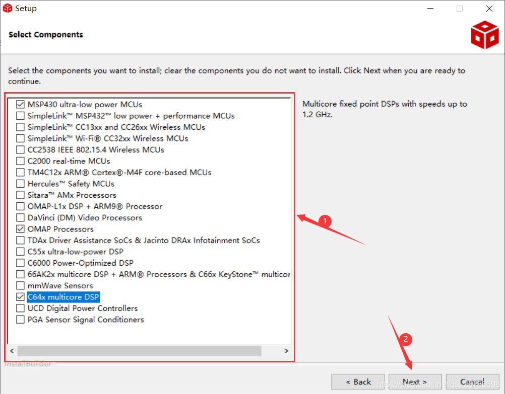
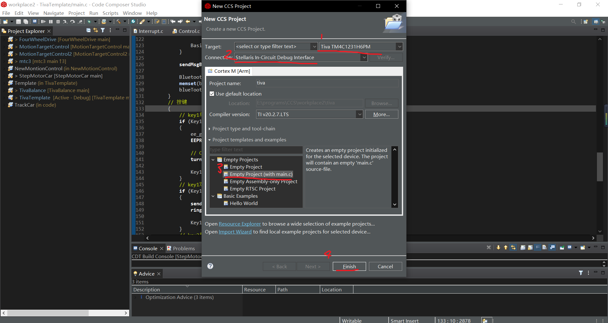
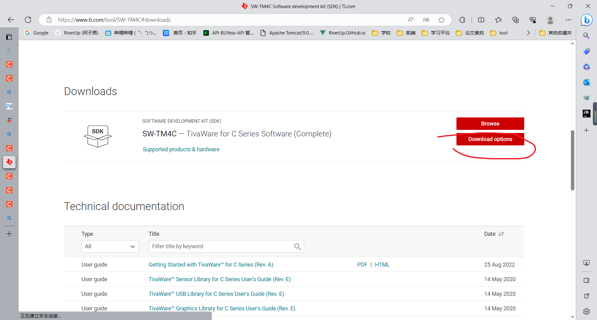
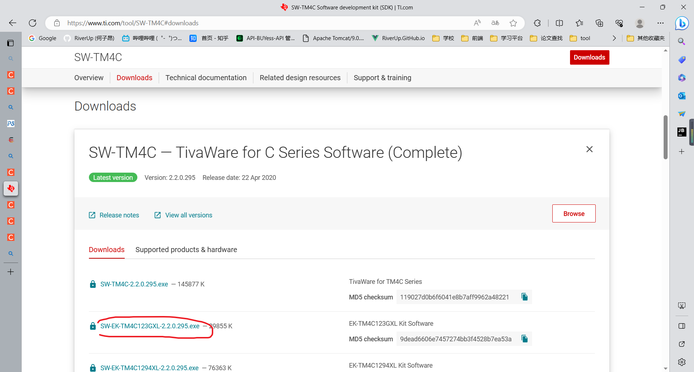
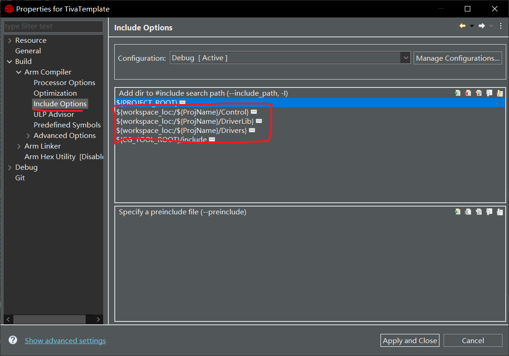
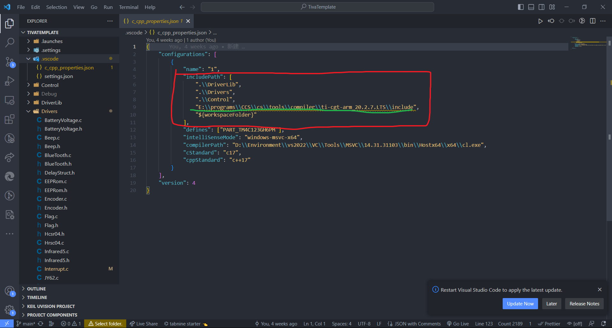

# 前言

付出了很多精力准备的电赛，最后因为种种原因没有取得理想的成绩，虽然为此感到非常的遗憾和痛苦，但实际上也收获了很多。

由于是TivaC123备赛，在准备电赛的过程中，相关资料可以说是相当之少，为此也踩过不少坑（包括比赛期间），所以在这里把自己已经完成的一些底层驱动代码分享给大家，希望能帮大家省时省力，也算证明一下自己参加电赛一趟也算是有所收获。

# 环境搭建

开发板型号：tm4c123g评估板

本来是打算像msp432一样配置keil的开发环境，但是tivaC系列开发板和msp系列的烧录有所不同。若使用keil向开发板烧录代码，其版本不能超过5.25，否则没法在options->debug中找到官方推荐的Stellaris ICDI下载器。然而在我的电脑上，尽管keil的options->debug中有Stellaris选项，但是这个选项无法被选中，所以我索性就直接使用TI官方的CCS开发环境。***在开发实践当中，使用CCS进行编译、烧录、debug，使用vscode进行代码编写，操作起来还是比较方便的***

CCS的下载就在此略去，若需参考请看[这里](https://blog.csdn.net/qq_36788698/article/details/82913956)



在这个界面记得勾选 `TM4C12x···`那栏

## 新建项目

在CCS的project栏选new CCS project

在弹出的界面进行如下操作



如果想将项目保存在自定义的路径下，就取消选定 `use default location`，并输入自己的路径

## TivaSDK

在进行自己项目的业务代码的开发之前，需要到[官网](https://www.ti.com/tool/SW-TM4C#downloads)上下载tivac123g开发板使用的软件包





这个软件包中解压后有一些例程代码（点灯等），同时也有一些必需的底层驱动。

将其中一些必需的底层驱动复制到项目路径下（主要是inc、driverlib路径下的一些文件，但是不能无脑复制，会报错）

可以参考我github仓库的已经[筛选好的DriverLib](https://github.com/RiverUp/TivaCSummary/tree/main/TivaTemplate/DriverLib)。当然也可以自己百度其他文章。

其中DriverLib->sensorlib路径下的文件是当初为了配置mpu6050引入的，但是事后并没有使用mpu6050作为角度传感器，所以这里也可以不复制它。在这里提到是想说，如果有什么特殊的需要也可以在我提供的DriverLib的基础上继续引入其他驱动文件，这里提供的DriverLib只是为了完成大多数基础功能的。

在项目的根目录新建一个main.h文件用来各种驱动文件的头文件引入。也可以把这部分放入main.c中，但我觉得这样更方便一些，因为同时可以将自己的驱动的头文件也在main.h中include，在所有驱动文件中仅需 `include "main.h"`就可以完成所有头文件的引入。

*main.h*的内容如下所示：

```c
#ifndef __MAIN_H
#define __MAIN_H

#include <stdio.h>
#include <stdint.h>
#include <stdlib.h>
#include <string.h>
#include <math.h>
#include "inc/hw_ints.h"
#include "inc/hw_memmap.h"
#include "inc/hw_types.h"
#include "inc/hw_ints.h"
#include "inc/hw_gpio.h"
#include "inc/hw_uart.h"
#include "inc/hw_pwm.h"
#include "inc/hw_adc.h"
#include "inc/hw_i2c.h"
#include "inc/hw_ssi.h"
#include "inc/hw_qei.h"
#include "inc/tm4c123gh6pm.h"

#include "driverlib/adc.h"
#include "driverlib/debug.h"
#include "driverlib/fpu.h"
#include "driverlib/gpio.h"
#include "driverlib/interrupt.h"
#include "driverlib/pin_map.h"
#include "driverlib/rom.h"
#include "driverlib/rom_map.h"
#include "driverlib/sysctl.h"
#include "driverlib/timer.h"
#include "driverlib/uart.h"
#include "driverlib/pwm.h"
#include "driverlib/i2c.h"
#include "driverlib/eeprom.h"

/*自己定义的头文件*/
···
/*自己定义的头文件*/

// 中断优先级定义
#define USER_INT0 0x00
#define USER_INT1 0x20
#define USER_INT2 0x40
#define USER_INT3 0x60
#define USER_INT4 0x80
#define USER_INT5 0xA0
// 延时函数定义
#define delayms(xms) SysCtlDelay(xms * (80000 / 3)) /*ms级延时*/
#define delayus(xus) SysCtlDelay(xus * (80 / 3))    /*us级延时*/

#endif

```

## 路径配置

### CCS



在project->properties中进行配置

### Vscode

如果用vscode打开目标项目，会在项目的根目录下生成一个.vscode文件夹，在该文件夹下新建一个 `c_cpp_properties.json`文件

添加如下内容：



主要是**红框**部分，其他的不重要或是已自动生成，其中需要将绿线画的路径替换为你下载CCS的对应路径（不过好像没有也行）

这个文件是告诉vscode项目需要的相关文件都在什么位置，配置好之后就可以很方便的使用vscode的代码补全，写代码用CCS是真的不方便。。。

在vscode编辑好代码后记得保存，这样在CCS编译时才能更新代码。

## 目录结构

这里只是说我们自己新添加的，新建项目时原有的一些目录保持原样不变

---

.

|--DriverLib

|	|--driverlib

|	|--inc

|--Control

|	|--Control.c

|--Drivers

|	|--Flag.c

|	|--Interrupt.c

|	|--其他（各种硬件的驱动，包括初始化、读数等）

|--.vscode

|	|--c_cpp_properties.json

|--main.c

|--main.h

---

其中 `Control.c`负责**控制**的业务逻辑； `Flag.c`存放各种标志位，及对其操作的函数； `Interrupt.c`中是各种中断回调函数的业务代码

在 `main.c`的主循环中进行各种标志位的轮询

# 资料

[here](https://github.com/RiverUp/TivaCSummary/tree/main/Resource)

包括原理图、库函数说明、各引脚功能表格
