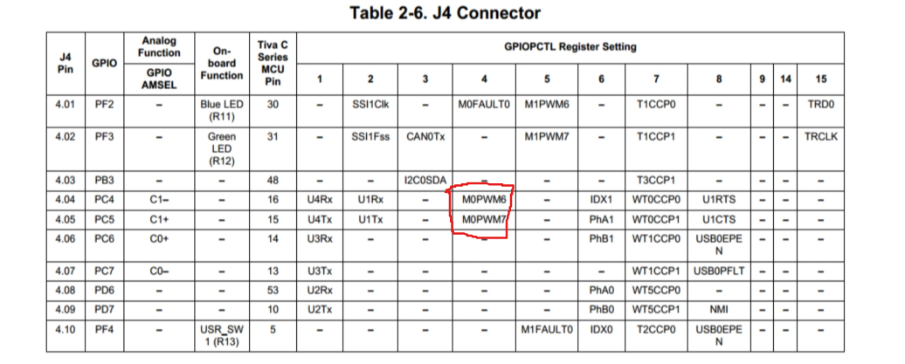

# 霍尔编码器

tivac123gx开发板不像stm32f10x系列的开发板定时器具有编码器模式，所以这里对于编码器的计数就是使用外部中断来进行的。

## 初始化

对于编码器所需的引脚的初始化其实就是对连接的引脚进行**外部中断的初始化**

这里我们使用的是很常见的tb6612作为减速电机的驱动

### 接线

按照如下方式接线

| TB6612 | TivaC123 |
| ------ | -------- |
| E2A    | PE2      |
| E2B    | PE3      |
| E1A    | PA5      |
| E1B    | PA4      |

### 代码

将四个引脚设为输入模式，并使能其外部中断

```c
void initEncoder()
{
    SysCtlPeripheralEnable(SYSCTL_PERIPH_GPIOE);
    GPIOPinTypeGPIOInput(GPIO_PORTE_BASE, GPIO_PIN_2 | GPIO_PIN_3);
    IntEnable(INT_GPIOE);
    GPIOIntTypeSet(GPIO_PORTE_BASE, GPIO_PIN_2 | GPIO_PIN_3, GPIO_BOTH_EDGES);
    GPIOIntEnable(GPIO_PORTE_BASE, GPIO_PIN_2 | GPIO_PIN_3);

    SysCtlPeripheralEnable(SYSCTL_PERIPH_GPIOA);
    GPIOPinTypeGPIOInput(GPIO_PORTA_BASE, GPIO_PIN_4 | GPIO_PIN_5);
    IntEnable(INT_GPIOA);
    GPIOIntTypeSet(GPIO_PORTA_BASE, GPIO_PIN_4 | GPIO_PIN_5, GPIO_BOTH_EDGES);
    GPIOIntEnable(GPIO_PORTA_BASE, GPIO_PIN_4 | GPIO_PIN_5);
}
```

## 计数

### 中断

中断的注册见前面按键部分

```c
void GPIOEIntHandler(void)
{
    uint32_t u32IntStatus = GPIOIntStatus(GPIO_PORTE_BASE, 0);
    GPIOIntClear(GPIO_PORTE_BASE, u32IntStatus);
    if (u32IntStatus & GPIO_INT_PIN_2)
    {
        if (GPIOPinRead(GPIO_PORTE_BASE, GPIO_PIN_2) == 0)
        {
            if (GPIOPinRead(GPIO_PORTE_BASE, GPIO_PIN_3) == 0)
                EncoderRight++;
            else
                EncoderRight--;
        }
        else
        {
            if (GPIOPinRead(GPIO_PORTE_BASE, GPIO_PIN_3) == GPIO_PIN_3)
                EncoderRight++;
            else
                EncoderRight--;
        }
    }
    if (u32IntStatus & GPIO_INT_PIN_3)
    {
        if (GPIOPinRead(GPIO_PORTE_BASE, GPIO_PIN_3) == 0)
        {
            if (GPIOPinRead(GPIO_PORTE_BASE, GPIO_PIN_2) == GPIO_PIN_2)
                EncoderRight++;
            else
                EncoderRight--;
        }
        else
        {
            if (GPIOPinRead(GPIO_PORTE_BASE, GPIO_PIN_2) == 0)
                EncoderRight++;
            else
                EncoderRight--;
        }
    }
}
```

```c
void GPIOAIntHandler(void)
{
    uint32_t u32IntStatus = GPIOIntStatus(GPIO_PORTA_BASE, 0);
    GPIOIntClear(GPIO_PORTA_BASE, u32IntStatus);
   
    if (u32IntStatus & GPIO_INT_PIN_4)
    {
        if (GPIOPinRead(GPIO_PORTA_BASE, GPIO_PIN_4) == 0)
        {
            if (GPIOPinRead(GPIO_PORTA_BASE, GPIO_PIN_5) == 0)
                EncoderLeft++;
            else
                EncoderLeft--;
        }
        else
        {
            if (GPIOPinRead(GPIO_PORTA_BASE, GPIO_PIN_5) == GPIO_PIN_5)
                EncoderLeft++;
            else
                EncoderLeft--;
        }
    }
    if (u32IntStatus & GPIO_INT_PIN_5)
    {
        if (GPIOPinRead(GPIO_PORTA_BASE, GPIO_PIN_5) == 0)
        {
            if (GPIOPinRead(GPIO_PORTA_BASE, GPIO_PIN_4) == GPIO_PIN_4)
                EncoderLeft++;
            else
                EncoderLeft--;
        }
        else
        {
            if (GPIOPinRead(GPIO_PORTA_BASE, GPIO_PIN_4) == 0)
                EncoderLeft++;
            else
                EncoderLeft--;
        }
    }
}
```

`EncoderLeft`，`EncoderRight`定义在了 `Encoder.c`中，并在 `Encoder.h`中用 `extern`声明

编码器的原理在这里就不多说了，简单来说就是A、B两相电平不同的编码器发生一次计数。至于电机旋转的正反与编码器计数的加减的对应关系，大家可以根据实际情况改变接线或者代码中的正负。

### 函数

```c
int readEncoder(uint8_t side)
{
    int coder_value = 0;
    if (!side)
    {
        coder_value = EncoderRight;
        EncoderRight = 0;
    }
    else
    {
        coder_value = EncoderLeft;
        EncoderLeft = 0;
    }
    return coder_value;
}
```

参数 `side`就是读左右哪个编码器的计数

这里为了获得“速度值”，每次读数后都会将编码器数值清零。也可以每次做差来获取每次计数间隔期间，编码器的数值变化。

# 减速电机

减速电机是根据pwm波的占空比来确定转速的，占空比越大，转速越快

## 接线

| TB6612 | TivaC123 |
| ------ | -------- |
| BIN2   | PB7      |
| BIN1   | PB6      |
| STBY   | PA2      |
| AIN1   | PD2      |
| AIN2   | PD3      |
| PWMA   | PC4      |
| PWMB   | PC5      |

## 初始化

减速电机的初始化涉及pwm引脚的初始化（用来输出pwm波）和输出引脚的初始化（用来确定方向和使能驱动板）

```c
void initMotor2()
{
//使能pwm引脚
    SysCtlPeripheralEnable(SYSCTL_PERIPH_PWM0);
    SysCtlPWMClockSet(SYSCTL_PWMDIV_4);
    SysCtlPeripheralEnable(SYSCTL_PERIPH_GPIOC);
    SysCtlPeripheralEnable(SYSCTL_PERIPH_GPIOD);
    GPIOPinTypePWM(GPIO_PORTC_BASE, GPIO_PIN_4);
    GPIOPinTypePWM(GPIO_PORTC_BASE, GPIO_PIN_5);
    GPIOPinConfigure(GPIO_PC4_M0PWM6);
    GPIOPinConfigure(GPIO_PC5_M0PWM7);
    PWMGenConfigure(PWM0_BASE, PWM_GEN_3,
                    PWM_GEN_MODE_DOWN | PWM_GEN_MODE_NO_SYNC);
    PWMGenPeriodSet(PWM0_BASE, PWM_GEN_3, 1000);
    PWMOutputState(PWM0_BASE, PWM_OUT_6_BIT, true);
    PWMOutputState(PWM0_BASE, PWM_OUT_7_BIT, true);
    PWMGenEnable(PWM0_BASE, PWM_GEN_3);
//使能方向引脚
    GPIOPinTypeGPIOOutput(GPIO_PORTD_BASE, GPIO_PIN_2 | GPIO_PIN_3);
    GPIOPinTypeGPIOOutput(GPIO_PORTB_BASE, GPIO_PIN_6 | GPIO_PIN_7);
//使能驱动板使能引脚
    GPIOPinTypeGPIOOutput(GPIO_PORTA_BASE, GPIO_PIN_2);
    GPIOPinWrite(GPIO_PORTA_BASE, GPIO_PIN_2, 0);
}
```

tiva的pwm比较特殊，既可以靠定时器输出，也准备了专门的pwm模块；tiva具备PWM0和PWM1两个模块，分别内置了定时器，每个模块有8个通道

与pwm相关的引脚可以靠查表获得



既然涉及到了定时器，就有一个频率问题

`SysCtlPWMClockSet()`是在设置pwm模块的时钟频率，参数为分频系数，在主频的基础上进行分频。我的工程中在 `main()`中设置的40mhz，经过4分频之后pwm的频率就是10mhz，这样比较方便设置占空比

*但是在操控舵机的时候就遇到了问题。*

因为一般舵机要求pwm的输出频率是固定的50hz。这个频率是比较低的，如果只用4分频搭配 `PWMGenPeriodSet(PWM0_BASE, PWM_GEN_3, 预装载值);`，是没有办法达到要求的。因为预装载值的寄存器是16位的，设到最大也只有65535，满足不了要求。所以要么把主频设低一点，要么分频值再高一点。

### 方向

PDx与PBx两组引脚，各控制一个电机的转动方向。以PD2，PD3为例：

PD2高电平，PD3低电平：左轮正转

PD3高电平，PD2低电平：左轮反转

电平相同是不转的

当然具体还要看你是怎么接的线，可以根据实际情况改代码或者接线

### 使能

使能就比较简单了

PA2高电平的时候电机才会工作，低电平就不工作了

## 设置电机转速

改变电机的转速实际上就是改变pwm的占空比

### 代码

```c
void setPWM2(int left, int right)
{
    if (left > 0)
    {
        GPIOPinWrite(GPIO_PORTD_BASE, GPIO_PIN_2, GPIO_PIN_2);
        GPIOPinWrite(GPIO_PORTD_BASE, GPIO_PIN_3, 0);
    }
    else
    {
        GPIOPinWrite(GPIO_PORTD_BASE, GPIO_PIN_2, 0);
        GPIOPinWrite(GPIO_PORTD_BASE, GPIO_PIN_3, GPIO_PIN_3);
    }

    if (right > 0)
    {
        GPIOPinWrite(GPIO_PORTB_BASE, GPIO_PIN_6, GPIO_PIN_6);
        GPIOPinWrite(GPIO_PORTB_BASE, GPIO_PIN_7, 0);
    }
    else
    {
        GPIOPinWrite(GPIO_PORTB_BASE, GPIO_PIN_6, 0);
        GPIOPinWrite(GPIO_PORTB_BASE, GPIO_PIN_7, GPIO_PIN_7);
    }
    int pwm_left = abs(left);
    int pwm_right = abs(right);

    PWMPulseWidthSet(PWM0_BASE, PWM_OUT_6, pwm_left);
    PWMPulseWidthSet(PWM0_BASE, PWM_OUT_7, pwm_right);
}

```

这段代码就是先确定好方向，再通过 `PWMPulseWidthSet()`设置占空比

在实际应用中，就通过编码器的读数，根据PID调节电机的转速
